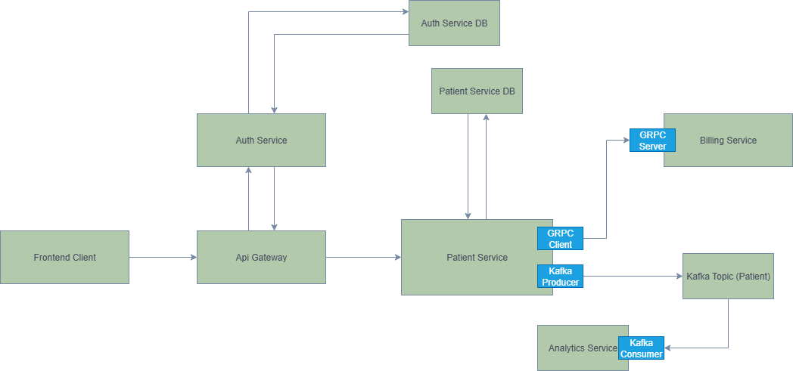

# WellNet - Healthcare Microservices Platform

WellNet is a comprehensive healthcare management system built using microservices architecture. The platform provides integrated services for patient management, billing, analytics, and authentication.

## System Architecture

Below is the high-level architecture diagram of the WellNet platform:



The system consists of the following microservices:

- **API Gateway Service**: Central entry point that handles routing
- **Authentication Service**: Manages user authentication and authorization
- **Patient Service**: Handles patient information
- **Billing Service**: Manages healthcare billing
- **Analytics Service**: Processes and analyzes patient

## Technologies Used

- Java Spring Boot
- Spring Cloud Gateway
- gRPC (for inter-service communication)
- Apache Kafka (for event-driven communication and data streaming)
- Docker & Docker Compose
- Maven
- Protocol Buffers

## Prerequisites

- Java 21
- Maven
- Docker and Docker Compose
- Git
- Windows OS (for running bat files.)

## Getting Started

On Windows:
Run "run.bat".

On other platforms:
``` bash
docker compose down && docker compose up --build -d
```

This will start all the services in the correct order with their dependencies.

## Service Endpoints

> **Important**: In production, all client requests should go through the API Gateway only. The individual service URLs listed below are primarily for development and testing purposes.

### API Gateway
- Production URL: `http://localhost:4004`
- This is the main entry point for all client applications
- Environment:
  - Auth Service URL: `http://auth-service:4005`

### Internal Service URLs (Development/Testing Only)

### Patient Service
- Internal URL: `http://localhost:4000`
- Database:
  - URL: `jdbc:postgresql://patient-service-db:5432/db`
  - External Port: `5000`
- Environment:
  - Billing Service gRPC: `billing-service:9001`
  - Kafka Bootstrap Servers: `kafka:9092`

### Billing Service
- Internal URL: `http://localhost:4001`
- gRPC Port: `9001`
- Manages billing and payment operations

### Analytics Service
- Internal URL: `http://localhost:4002`
- Environment:
  - Kafka Bootstrap Servers: `kafka:9092`
- Processes data analytics and reporting

### Auth Service
- Internal URL: `http://localhost:4005`
- Database:
  - URL: `jdbc:postgresql://auth-service-db:5432/db`
  - External Port: `5001`
- Environment:
  - JWT Secret: Configured via environment variable

### Infrastructure Services

#### Databases
- Patient Service Database:
  - Port: `5000:5432`
  - Credentials:
    - User: postgres
    - Database: db
  
- Auth Service Database:
  - Port: `5001:5432`
  - Credentials:
    - User: postgres
    - Database: db

#### Message Broker
- Kafka:
  - Internal URL: `kafka:9092`
  - External Ports: 
    - `9092` - Internal communication
    - `9094` - External access
  - Listeners:
    - PLAINTEXT: `://kafka:9092`
    - EXTERNAL: `://localhost:9094`
    - CONTROLLER: `://:9093`

### Inter-Service Communication

#### gRPC Communication
The services use gRPC for synchronous inter-service communication.

#### Event-Driven Communication with Kafka
The system uses Apache Kafka for asynchronous event-driven communication between services. Key features include:

- **Patient Events**: Patient service publishes patient-related events (registration, updates, etc.)
- **Analytics Processing**: Analytics service consumes events for real-time data processing

Make sure Kafka is running before starting the services. Kafka is included in the Docker Compose configuration.


## API Documentation

All API endpoints are accessible through the API Gateway (`http://localhost:4004`). The gateway routes requests to appropriate microservices and handles cross-cutting concerns like JWT validation.

### API Documentation Access

OpenAPI/Swagger documentation for each service can be accessed through the API Gateway:

#### Swagger UI
- Auth Service UI: `http://localhost:4005/swagger-ui/index.html`
- Patient Service UI: `http://localhost:4000/swagger-ui/index.html`

#### OpenAPI JSON
- Auth Service Documentation: `http://localhost:4004/api-docs/auth`
- Patient Service Documentation: `http://localhost:4004/api-docs/patients`

### Authentication Service API

Base Path: `/auth`

#### Authentication Endpoints
1. **Login**
   - Path: `/auth/login`
   - Method: `POST`
   - Description: Generate token for user login
   - Request Body:
     ```json
     {
       "username": "string",
       "password": "string"
     }
     ```
   - Responses:
     - 200: Successful login with JWT token
     - 401: Unauthorized

2. **Validate Token**
   - Path: `/auth/validate`
   - Method: `GET`
   - Description: Validate JWT token
   - Headers:
     - `Authorization: Bearer <token>`
   - Responses:
     - 200: Token is valid
     - 401: Token is invalid or missing

### Patient Service API

Base Path: `/api/patients`

#### Patient Management Endpoints
1. **Get All Patients**
   - Path: `/api/patients`
   - Method: `GET`
   - Description: Get all patients
   - Headers:
     - `Authorization: Bearer <token>`
   - Responses:
     - 200: List of patients
     - 401: Unauthorized

2. **Create Patient**
   - Path: `/api/patients`
   - Method: `POST`
   - Description: Create a new patient
   - Headers:
     - `Authorization: Bearer <token>`
   - Request Body: PatientRequestDTO
   - Validation: Uses CreatePatientValidationGroup
   - Responses:
     - 200: Patient created successfully
     - 401: Unauthorized

3. **Update Patient**
   - Path: `/api/patients/{id}`
   - Method: `PUT`
   - Description: Update an existing patient
   - Headers:
     - `Authorization: Bearer <token>`
   - Parameters:
     - Path: id (UUID)
   - Request Body: PatientRequestDTO
   - Responses:
     - 200: Patient updated successfully
     - 401: Unauthorized

4. **Delete Patient**
   - Path: `/api/patients/{id}`
   - Method: `DELETE`
   - Description: Delete a patient
   - Headers:
     - `Authorization: Bearer <token>`
   - Parameters:
     - Path: id (UUID)
   - Responses:
     - 204: Patient deleted successfully
     - 401: Unauthorized

### API Gateway Route Configuration

The API Gateway is configured with the following routes:

1. **Patient Service Routes**
   - Base Path: `/api/patients/**`
   - Target: `http://patient-service:4000`
   - Features:
     - JWT Validation
     - Path Strip Prefix

2. **Auth Service Routes**
   - Base Path: `/auth/**`
   - Target: `http://auth-service:4005`
   - Features:
     - Path Strip Prefix

3. **API Documentation Routes**
   - Patient Service Docs: `/api-docs/patients`
   - Auth Service Docs: `/api-docs/auth`

2. **OpenAPI JSON**
   - Auth Service: `http://localhost:4005/v3/api-docs`
   - Patient Service: `http://localhost:4000/v3/api-docs`

> Note: All API endpoints should be accessed through the API Gateway in production. Direct service URLs are for development and documentation purposes only.

## License

This project is licensed under the terms found in the LICENSE file in the root directory.
